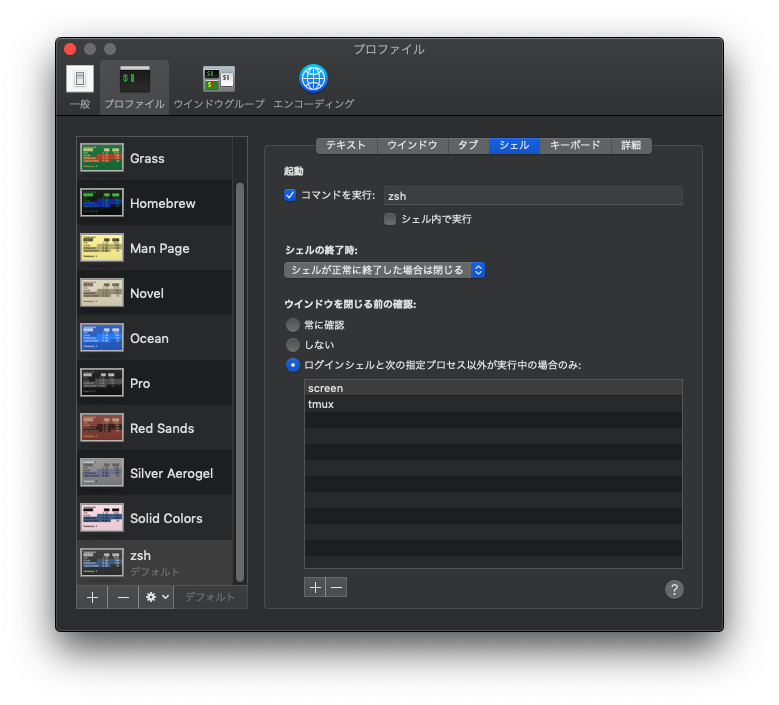
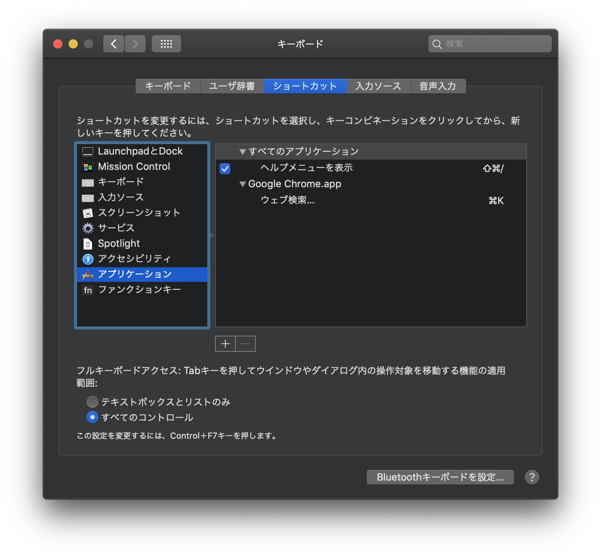

# dotfiles

今の所、mac前提

## 使い方

※ setup.sh が Homebrew https://brew.sh/ をインストールして、各種アプリをインストールします。

```
$ cd
$ git clone git@github.com:mstssk/dotfiles.git $HOME/dotfiles
$ cd $HOME/dotfiles
$ ./setup.sh
$ zsh
```

zshをターミナルのデフォルトに設定するなど別途必要

| ターミナルの設定例 |
|:---------------:|
|  |

## よく使うソフト

- Clipy https://clipy-app.com/
- ImageOptim https://imageoptim.com/mac
- MacTeX https://www.tug.org/mactex/
- Hidden Bar https://apps.apple.com/jp/app/hidden-bar/id1452453066?mt=12
    - 仕事の都合で入れたくもない常駐ソフトをインストールして、しかもそれがmacのテーマ機能に対応していなくてメニューバー上で目立ってうざいときに使う。

### Macの環境カスタム

- BetterTouchTool https://folivora.ai/

### 開発

- Visual Stuio Code https://code.visualstudio.com/
    - 設定同期する拡張機能: https://marketplace.visualstudio.com/items?itemName=Shan.code-settings-sync
- Docker for Mac https://docs.docker.com/docker-for-mac/
- Java Platform, Standard Edition https://www.oracle.com/technetwork/java/javase/downloads/index.html

## よく使うショートカットキー

システム設定 → キーボード → アプリケーション

- Google Chrome.app
    - Web検索… → ⌘K

| システム設定でショートカットキーを変更 |
|:---------------:|
|  |

## その他

- [よく使う物理デバイス](./doc/physical_devices.md)

----

Inspired by https://github.com/vvakame/dotfiles
